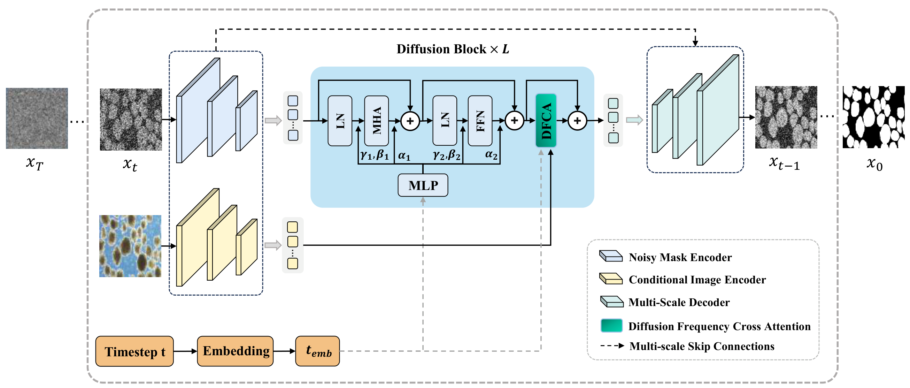
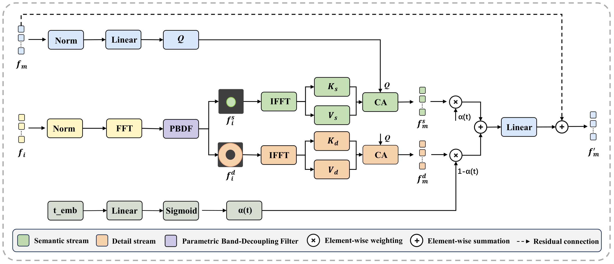
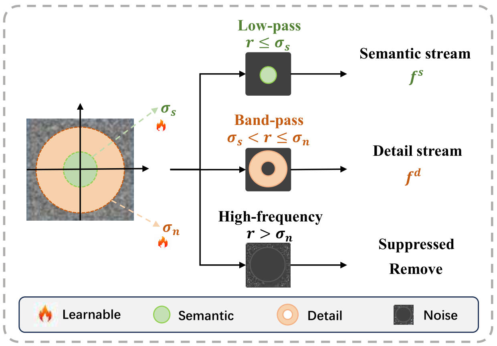

# StruFreq-DiT

This is the official implementation of the TMI paper under review:
**StruFreq-DiT: A Structure-Aware Diffusion Transformer with Frequency-Adaptive
Conditioning for Medical Image Segmentation**.

StruFreq-DiT casts segmentation as an image-conditioned denoising process in the
**segmentation-mask space**: a Diffusion Transformer backbone denoises a noisy
mask conditioned on the medical image and predicts the clean mask $\hat{y}_0$
directly at every timestep. Two designs adapt the plain Diffusion Transformer to
medical segmentation: **SSE** (Spatial Structure Enhancement) and **DFCA**
(Diffusion Frequency Cross-Attention) with a parametric band-decoupling filter
**PBDF**.



This repository contains the **training and inference code for the full model
only**. The network is fixed: there are no module switches, and training and
inference always build the same architecture.

---

## Method

At a denoising step `t`, the image `x` and the noisy mask `y_t` go through the
two **SSE** encoding branches, which produce backbone tokens plus multi-scale
skip features each. The mask tokens run through `L` StruFreq-DiT blocks
(self-attention with 2D RoPE + SwiGLU FFN, modulated by the timestep with
adaLN-Zero), and **DFCA** injects the image condition after every block. The SSE
decoder then upsamples the refined tokens, fusing the image-stream and
mask-stream skips at each scale, and a `tanh` output layer gives the clean-mask
estimate. The image condition reaches the mask stream through DFCA only, so
image tokens never enter the backbone self-attention.



DFCA takes the mask tokens as queries and the image tokens as keys/values, and
splits the latter by frequency band into a semantic stream and a detail stream,
each with its own attention temperature. **PBDF** makes that band split
learnable through two bandwidths `sigma_s < sigma_n`, and a timestep-dependent
gate `alpha(t)` mixes the two streams, shifting from semantics at high noise to
detail as `t` decreases.

<p align="center">
  
</p>

| Component | Where in the code |
| --- | --- |
| SSE encoding branch (image / noisy mask) | `MultiScaleEncoder` in `model_strufreq_dit.py` |
| StruFreq-DiT block (MHSA + 2D RoPE + SwiGLU + adaLN-Zero) | `StruFreqDiTBlock` |
| DFCA + PBDF condition injection | `DFCA`, `DFCA._freq_decompose` |
| SSE decoding path (symmetric decoder, dual-stream skips) | `UNetDecoder`, `TimeModulatedSkip` |
| Forward diffusion, DDIM sampling, training loss | `diffusion_utils.py` |

---

## Installation

```bash
conda env create -f environment.yaml
conda activate strufreq-dit
```

or, with an existing PyTorch installation:

```bash
pip install -r requirements.txt
```

## Data

No data is shipped with this repository. Download the datasets from their
original sources, then arrange them **yourself** into the layout below — the
loader reads nothing else.

| Dataset | Task | Size | Input | Source |
| --- | --- | --- | --- | --- |
| GlaS | Gland segmentation (H&E) | 165 images | 256×256 | https://warwick.ac.uk/fac/cross_fac/tia/data/glascontest/ |
| MoNuSeg | Nuclei segmentation (H&E) | 51 images | 512×512 | https://monuseg.grand-challenge.org/Data/ |
| PH2 | Skin lesion (dermoscopy) | 200 images | 256×256 | https://www.fc.up.pt/addi/ph2%20database.html |
| IMID | Islet tissue (H&E), private | 400 images | 256×256 | not public |
| TNBC | Nuclei segmentation (H&E) | ~50 images | 512×512 | https://zenodo.org/records/1174343 |

TNBC is only the target domain of the cross-dataset experiment (a MoNuSeg model
evaluated on TNBC without fine-tuning), so it needs a `test/` split only.

### Directory layout

Put the prepared folders in the project root, one per dataset:

```
StruFreq-DiT/
├── processed_glas/
│   ├── train/
│   │   ├── images/    img_001.png, img_002.png, ...
│   │   └── masks/     img_001.png, img_002.png, ...
│   ├── val/
│   │   ├── images/
│   │   └── masks/
│   └── test/
│       ├── images/
│       └── masks/
├── processed_monuseg/   same structure
├── processed_ph2/       same structure
├── processed_imid/      same structure
└── processed_tnbc/      test/ only (cross-dataset evaluation)
```

Rules the loader relies on:

* An image and its mask are matched **by file name stem**, so `img_001.png` in
  `images/` pairs with `img_001.png` (or `img_001.tif`, ...) in `masks/`.
  Accepted extensions: `.png`, `.jpg`, `.jpeg`, `.bmp`, `.tif`, `.tiff`.
* Images are RGB (grayscale is converted); masks are **single-channel binary**,
  background 0 and foreground 255 (anything > 127 counts as foreground).
* Images and masks may be stored at any size — they are resized to
  `--image_size` on load (bilinear for images, nearest for masks) — but storing
  them already at the target size keeps loading fast.
* The three splits are fixed on disk. The paper uses a sample-wise (patient-wise
  for GlaS) 6 : 2 : 2 train / val / test split; MoNuSeg instance annotations are
  merged into a binary foreground mask.

## Training

Image size, model variant, epochs, learning rate, batch size, dropout and early
stopping are all selected from `--dataset`; see `_DATASET_DEFAULTS` in
`train.py`.

```bash
python train.py --dataset glas
python train.py --dataset ph2
python train.py --dataset imid
python train.py --dataset monuseg          # 512x512, patch size 32

# resume
python train.py --dataset glas --resume checkpoints/<run>/checkpoint_epoch100.pth
```

| Dataset | Input | Variant | Batch | LR |
| --- | --- | --- | --- | --- |
| GlaS | 256² | StruFreq-DiT-B/16 | 8 | 2e-4 |
| PH2 | 256² | StruFreq-DiT-B/16 | 8 | 2e-4 |
| IMID | 256² | StruFreq-DiT-B/16 | 4 | 2e-4 |
| MoNuSeg | 512² | StruFreq-DiT-B/32 | 4 | 1e-4 |

Common to all runs: `T = 200` diffusion steps, cosine noise schedule, direct
$\hat{y}_0$ prediction, AdamW with weight decay 0.05, MSE + soft Dice loss
(`λ_Dice = 1.0`), EMA (decay 0.9999), cosine LR schedule with warmup, and
training from scratch (no pretrained weights). Runs are capped at 20k epochs
and stopped early once the validation mIoU stops improving (not before 10k
epochs), which is where the reported models land.

Checkpoints go to `checkpoints/<dataset>_<model>_<timestamp>/`, TensorBoard
logs and loss curves to `logs/`. Evaluate `best_model.pth` (best EMA validation
mIoU).

Variants: `StruFreq-DiT-{S,B,L,H}/{16,32}`, i.e. depth 4 / 6 / 8 / 12 with hidden
size 512 / 768 / 1024 / 1280 and patch size 16 or 32. The paper uses `B`.

## Inference

```bash
python inference.py \
    --checkpoint checkpoints/<run>/best_model.pth \
    --dataset glas --use_ema --K 25 --save_images
```

Reports mIoU, DSC, Sensitivity, Accuracy, Precision, HD95, GED and ECE, plus
the parameter count and GFLOPs; results are written to
`results/<dataset>/metrics.txt`, and `--save_images` additionally writes the
predictions and image/GT/prediction comparison strips.

`--K` is the number of independent DDIM trajectories averaged into the MMSE
estimate (`--K 1` is fastest, `--K 25` is the setting used in the paper);
`--ddim_steps` sets `T'` (20 by default) and `--eta 0` keeps sampling
deterministic. The model variant and input size are read from the checkpoint,
so they do not have to be repeated.

Cross-dataset generalization (a MoNuSeg model evaluated on TNBC, no
fine-tuning):

```bash
python inference.py --checkpoint checkpoints/<monuseg-run>/best_model.pth \
    --dataset tnbc --use_ema --K 25
```

## Repository layout

```
model_strufreq_dit.py    model definition (SSE, DFCA/PBDF, DiT backbone) and variants
diffusion_utils.py    cosine schedule, DDIM sampling, MSE + Dice loss
dataset.py            dataset loaders and dataloader factories
train.py              training entry point
inference.py          evaluation and metrics
training_logger.py    logging and loss curves
util/model_util.py    2D RoPE, sincos positional embedding, RMSNorm
```


## License

Released under the [MIT License](LICENSE).
